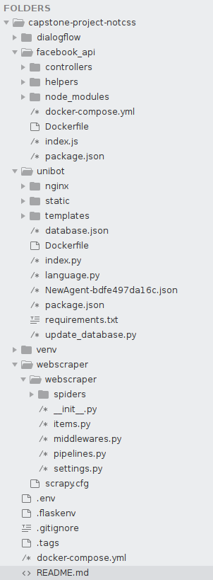

# User Documentation
### File Skeleton
- **dialogflow** directory contains all dataset for the chatbot training
- **facebook_api** directory includes controllers folder (to make Facebook API verify our webhook) and helpers folder (to make request to Diloagflow from Facebook API), index.js as webserver hook and Dockerfile for deployment. 
- **unibot** includes all the necessary files for seting up our chatbot web interface. Nginx folder contains the Nginx configuration file, static has javascripts and image files and templates contains html files for index.py. NewAgent-bdfe-497da16c.json is the JSON file to connect Dialogflow from backend. Update_database.py is served for gaining the data from web scraper stored at database.jso and putting on MongoDB.
- **webscraper** contains two spiders for scraping UNSW websites.

### Deployment
1. Choose Ubuntu 18.04 as the primary operating system and install docker, docker-compose on the VM instance. See installation guides below for docker and docker-compose
- Docker installation guide: https://www.digitalocean.com/community/tutorials/how-to-install-and-use-docker-on-ubuntu-18-04
- docker-compose installation Guide https://www.digitalocean.com/community/tutorials/how-to-install-docker-compose-on-ubuntu-18-04
- Build Docker containers of our chatbot web application, database and Facebook integration by running `docker-compose up --build -d`. a. The command line means we use docker-compose to build (--build) and up in detached mode (-d). It will take a while to install packages and modules (around 40 seconds). With only one command, we can have the chatbot web application, Mongo DB and Facebook integration running locally. 
- For local access, the chatbot is now can be viewed via browser with the address http://localhost:7207 and the MongoDB database with the address http://localhost:27017  
- For website hosting, the chatbot is available at https://unibot.unswsecurity.com/  

### Third Party Packages
- **Dialogflow (Framework and Python Client)**: Dialogflow oversees detecting user’s input/message and return the corresponding answer to the user via chatbot. Dialogflow is integrated to our backend via Python client API since backend is also used Python for development.
- **Langdetect (Python Library)**: This has been used to detect the language in which the user sends a query from the frontend and pass the corresponding language code to Dialogflow.
- **Flask (Python Web Framework)**: Flask – a popular Python micro framework – has been used in this project to serve as our backend. Flask is simple and rapid to write and deploy and it can easily connect to Dialogflow via API, MongoDB via RESTful API.
- **Scrapy (Python Package)**: Scrapy is open source and more robust than BeautifulSoup which is useful when scraping big information. We can generate and control our spiders with few simple command lines such as `scrapy crawl <spider_name>`. There are two spiders: unsw_enrolment.py and dates.py which get necessary information from 3 UNSW websites about enrolment and then dump into a JSON file. 
- **MongoDB, pymongo (Python Package)**: MongDB is our database and we use its Python package - pymongo to connect to database.
- **dotdotdot (NPM Package)**: To make website descriptions short to accommodate it in the rich link preview container and to provide a intuitive indication of the summarization.
- **Richlink Preview API**: To provide a better user experience the customer wanted the UI to show a preview and summary of the website the UniBot suggested.
- **Facebook API and Node.js**: Facebook API is a platform for building applications which can be used in Facebook Messenger. Beside the API, we also need to set up webhook server. The webhook enable the chatbot to get notifications from different interactions and events such as when users send messages so that the chatbot can send answers back. Since Node.js is lighting fast for a quick set, we chose it for Facebook Messenger integration. Apiai - an npm package - is used to connect Facebook API and Dialogflow and express is for quickly set up webhook. 
- **Google Cloud Platform**: Google Compute Engine is the Infrastructure as a Service component of Google Cloud Platform which enables users to launch virtual machines quickly and all team members can work on the same up-to-date version. We chose Ubuntu 18.04 as our virtual machine for hosting our backend, frontend, database and webhook server for Facebook integration. 
- **Docker and docker-compose**: To automate the deployment and help developers focus more on developing the chatbot without worrying the deploying phase.
- **Nginx**: Nginx serves as reverse proxy as when a user types the URL of the chatbot in a web browser, Nginx will look for a service running at a certain port which is related to that URL. In this project, the website chatbot is running at port 7207 ;therefore, Nginx configuration file which is stored at /etc/nginx/sites-available will helping passing requests from users visiting the website to our chatbot at port 7207. 
